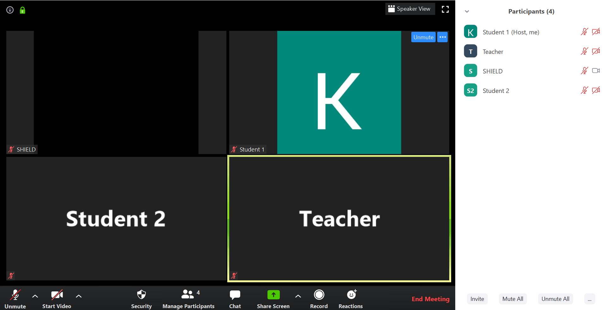

# SecureConnect
This is a hackathon project to detect NSFW content in a video stream.

# Inspiration
With countries in lockdown and people in quarantine, Zoom has been one of the popular software at this time that has gained huge user base to have video conferences for work as well as for personal conversations. With many schools and businesses using Zoom as a meeting platform, there has been lot of “Zoombombing”.  This term used when uninvited participants join the meeting and harass by projecting derogatory and pornographic content. Zoombombing has become a serious issue especially with many incidents being reported where pornographic content was projected in school classroom sessions. This has led us to develop a bot which can detect nudity in Zoom meetings and remove the participant. Our bot can also detect any unintended topless video stream of the participants and remove them thereby avoiding any embarrassments.

# Function
The bot is invited to the meeting just like a participant <by sending an invite??>. The bot then joins the meeting and continuously monitors the video feed of the meeting to detect any nude content. If it finds something it will remove the participant if it has the host permission, else it will notify the host. The bot is created from machine learning algorithm and neural networks that has been trained to detect nudity. The dataset <technical details…>

# Flow



# Installation
```
poetry install
```
Do note this does not install `opencv`, that has to be installed separately.

# Usage:
```
Usage:poetry run sfw [--tolerance=<tolerance>] [--debug]

>>>>>>> fix: merge conflicts
Options:
--tolerance=<tolerance>   Number of video frames to tolerate before issuing a warning.[default=4]
--debug                   Prints the inference logs.
```
This will throw an exception `UnsafeEnvironment` if more than `tolerance` number of frames contain NSFW content.
